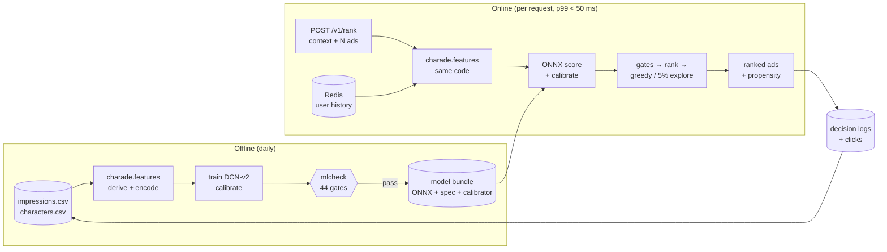

# 🎭 Charade

Charade (**chara**cter + **ad**) ranks contextual ads inside AI companion chats. For each ad opportunity (character, conversation moment, publisher, device, hour) and a set of candidate ads, it predicts the click probability, filters out ads that don't fit (brand safety, frequency caps, budget), and returns a ranked list in under 50 ms.



Results in one page: [docs/00-summary.md](docs/00-summary.md). Everything else: [docs/index.md](docs/index.md).

## 🚀 Run it

Requirements: [uv](https://docs.astral.sh/uv/) (installs Python 3.12 if missing). Optional: Docker for `docker compose up` (API + Redis), Terraform ≥ 1.13 for the infrastructure checks.

```bash
uv sync --all-packages --extra train --extra gpu  # install (use --extra cpu without an NVIDIA GPU)
cp .env.sample .env                            # optional: overrides and API keys
cp /path/to/{impressions,characters}.csv .     # raw data, gitignored
uv run poe mlcheck-data                        # check the data contract
uv run poe train                               # train + calibrate + evaluate + export (~1 min on a GTX 1660)
uv run poe ope && uv run poe parity            # ranking-policy evaluation, train/serve parity
uv run mlcheck .                               # all 44 ML release gates against the run
uv run poe serve                               # API on http://127.0.0.1:8000 (docs at /docs)
docker compose up --build                      # or: API (8 workers) + Redis, bundle mounted
uv run poe loadtest                            # latency at 400 rps against the running API
uv run poe                                     # list every task
```

The API contract is committed at [docs/api/openapi.json](docs/api/openapi.json) and regenerated with `uv run poe openapi`. CI fails if it is stale.

The infrastructure sketch (AWS, Terraform, validated not applied) and delivery are described in [docs/07-serving-operations.md](docs/07-serving-operations.md).

## ⚙️ Settings

Every setting lives in `pyproject.toml`: tool settings under `[tool.<name>]`, project settings under `[tool.charade]`, tasks under `[tool.poe.tasks]`. `CHARADE_*` environment variables (or `.env`) override them. API keys come only from the environment; see [.env.sample](.env.sample).

## 🤝 Contribute

1. Read [AGENTS.md](AGENTS.md). It holds the rules, invariants and definition of done for humans and AI agents alike.
2. Find the doc for your area in [docs/index.md](docs/index.md).
3. Before committing, run what CI runs:
   ```bash
   uv run poe check   # lint, types, tests (charade + mlcheck), ML static gates
   uv run poe tf      # terraform fmt + validate
   ```
   If you changed the API, run `uv run poe openapi` and commit the contract. If you regenerated reports, run `uv run poe docs-numbers`: numbers written `<!--n:key-->…<!--/n-->` in the docs come from `reports/`, and CI fails when they drift.
4. Docs in `docs/` carry `title` / `created-at` / `updated-at` frontmatter; bump `updated-at` when you edit one (tests in `tests/docs` check freshness, links and `poe` commands).
5. Use atomic [conventional commits](https://www.conventionalcommits.org/) (`feat(ranking): …`). Every commit must pass its own tests.
